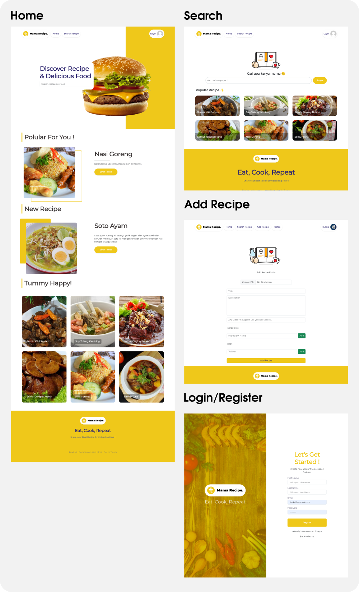

# Mama Recipe Web Frontend

  

This website is a place where you can find and share delicious recipes from various cuisines. You can search for your favorite food, or browse through the popular dishes that are recommended for you. You can also learn how to make nasi goreng, soto ayam, semur kikil, and many other mouth-watering dishes from the comfort of your home. Whether you are a beginner or a master chef, you will find something that suits your taste and skill level. You can also upload your own recipe and show off your culinary talent to the world. Join this website today and eating, cooking, and repeating!

Developer :

Tech Stack : Javascript, ReactJS, React Router, Redux, Bootstrap  
Preview : <https://recipes-web-fe.vercel.app>  

## Table of content

- [Mama Recipe Web Frontend](#mama-recipe-web-frontend)
	- [Table of content](#table-of-content)
	- [Screenshoots](#screenshoots)
	- [How to Run](#how-to-run)
		- [Run on local](#run-on-local)
		- [Run on production](#run-on-production)
	- [Releated Project](#releated-project)

## Screenshoots

  

## How to Run

To run this app, you need to running the the backend first, get backend at <https://github.com/Team-A-Pijarcamp-Batch-15/receipes-web-be>, then you can setup the backend first. after the backend setup finish, you can get the URL from your console or terminal. or if you deploy on cloud, you can get the URL from your cloud provider.

### Run on local

1. Rename ``.env.example`` to ``.env`` then fill the ``BE_URL`` with your own backend URL
2. Then install the dependencies with command ``npm install`` or ``yarn install``
3. finally you can start the app with ``npm run start``

### Run on production

On production has a variety way to run the application, but the most important is **Environment Setup** and **The Knowledge about your cloud provider, to run this app.** for this you can read the documentation that provided by your cloud provider.

## Releated Project

- [✨ Mama Recipe Web Demo](https://recipes-web-fe.vercel.app)
- [✨ Mama Recipe Web Frontend](https://github.com/Team-A-Pijarcamp-Batch-15/recipes-web-fe)
- [✨ Mama Recipe Web Backend](https://github.com/Team-A-Pijarcamp-Batch-15/receipes-web-be)
